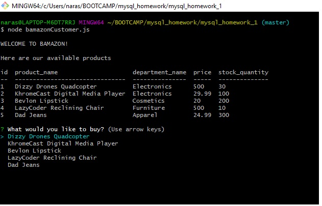
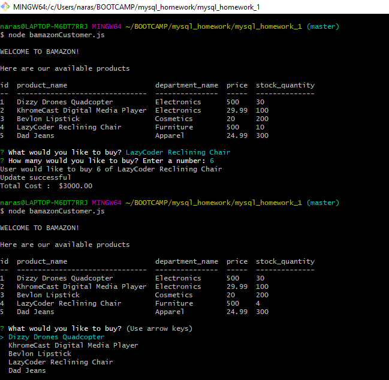
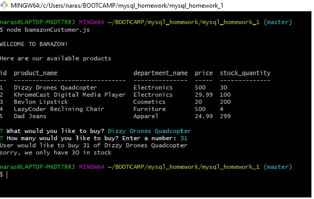
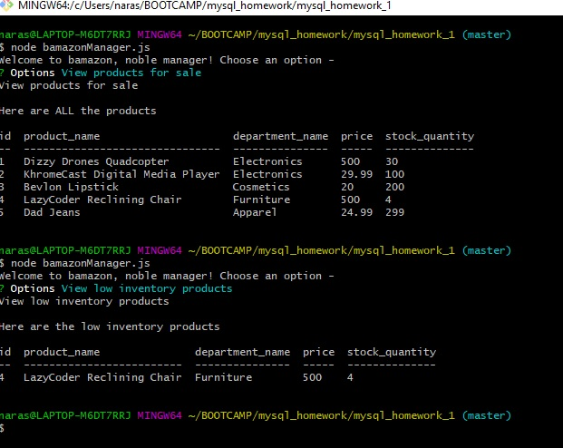
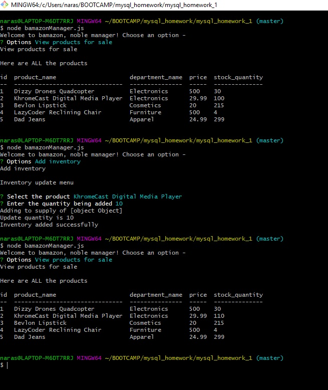
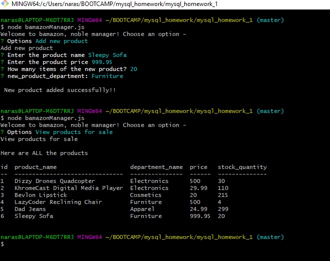

# **mysql_homework_1**

# **Summary**

This project implements an Amazon-like storefront using MySQL to store product information.

It provides two separate interfaces - one for users, and the other for managers. 
**(Did not implement supervisor interface)**

The user can perform the following operations
* View the entire product list
* Order a product

The manager can perform the following operations
* View the entire product list
* View low inventory products
* Add to the inventory of an existing product
* Add a completely new product

# **Implementation Details**

## **Database Specifics**

### **Database Schema**

Database name : **bamazon**

Tables:
* products
* departments

Product information is stored in a table named 'products'. The products table has the following fields (columns)
* Product ID (Unique identifier and Primary Key for this table)
* Product description
* Department name (The department that a particular product belongs to)
* Price
* Stock (available quantitity)

Department information is stored in a table named 'departments'. The departments table has the following columns
* Department ID
* Department Name
* Overhead
* Product Sales

### **Database Creation (Seeding)**

A [seed file](seed.sql) creates the bamazon database, and the products and departments tables in the bamazon database.
It also pre-populates the 'departments' and 'products' tables with some initial data.

## **NodeJS specifics**

This project has two NodeJS applications - bamazonCustomer and bamazonManager

### **bamazonCustomer** ###

Here is the main menu for the bamazon customer app.

It displays the complete catalog of products, and asks the user what they'd like to purchase.

After the user selects a product and enters a quantity (number of items), the application checks if there's enough inventory for the user's order.

If there is enough inventory, the application processes the order by 
* deducting the specified number of items from the inventory (updates the 'products' database with new count)
* displaying the total price to the user

After placing the order, the app exits. When launched again, the user will see the updated inventory count.

On the other hand, if there aren't enough items of the chosen product, the app displays an error.

### **bamazonManager** ###

The bamazonManager app implements the required options.
* View the entire product list
* View low inventory products
* Add to the inventory of an existing product
* Add a completely new product

Here is a snapshot of the first two operations (view all products, view low inventory products)

In the above example, on the 'LazyCoder reclining chair' has an inventory count less than 5. Therefore, only this product shows up in the low inventory query result.

Here is a snapshot of the 'add inventory' operation. Here we add 10 of the KhromeCast Digital Player. The item count is updated from 100 to 110.

Lastly, here is a snapshot of the 'Add New Product' operation. A new product named 'Sleepy Sofa' was added. It's department is 'furniture'. The item count was 20, and price was $999.95

